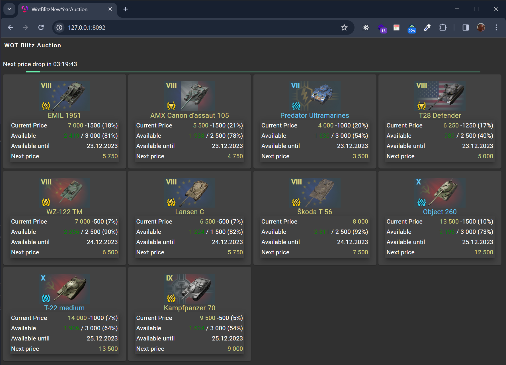

This repository is a sample of basic application in 4 different technologies: .net Console app; .net Blazor WebAssembly app; React app and Angular app.
For test purpose the application requests some data from some public WEB API and shows the data in the UI. 
The logic of the application is primitive and does not matter. This repo is just a scaffold of SPA in 3 different frameworks.
(This is related to the `World Of Tanks Blitz` game. Wargaming company provides the API endpoint).

# Console App:

# Blazor + Bootstrap.5

# React + MUI

# Angular Material

